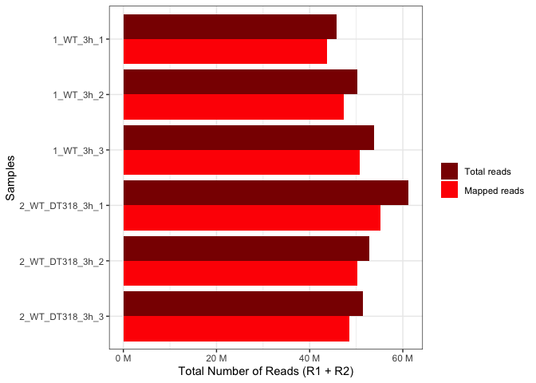

# RNASeq Analysis on DT23 treated Cn cells

### Experimental set-up

1.  WT (H99) and arg1∆ (H99 background) cells were allowed to grow over
    night in 50ml YPD media in 250ml flask at 220 rpm, 30C.

2.  Refresh OD=1.8/ml in 10ml fresh YPD for 2hr (total OD=18)

3.  After 2hr cells were treated with 100µM DT318 and equal amounts of
    DMSO as control (20µl from 50mM stock of DT318)

4.  cells were incubated for 3hr at 30C, 220rpm

5.  cells were harvested by spinning at 4400rpm for 5min, discard the
    supernatant snap freeze in liquid N2 and later in -80C

6.  RNA extraction by trizol (1ml)

7.  Resuspend RNA in nuclease free water (100µl)

8.  Purify by qiagen RNeasy mini column kit.

9.  RNA quantified by nanodrop and quality assessment by tapestation and
    samples with RIN value \>7 were further processed

10. RNA library prepared using 1µg of RNA with illumina stranded mRNA
    library prep kit *1000000124518*

library was sequenced at AGRF sequencing facility run on one Novaseq X
300 cycle (150bp PE)

### Alignment statistics

1.  Raw fastq files were aligned to FungiDb reference genome:
    FungiDB-59_CneoformansH99 using STAR aligner (DT23=DT318)

2.  Below are the mapping statistics for each of the sample;

``` r
library(magrittr)

star_dir <- "/Users/pooja/Documents/ARG1_project/rnaseq_3h/03_alignment/for_DT318_paper/"

star_align_log_files <- fs::dir_ls(star_dir, 
                                   glob = "*Log.final.out" ,
                                   recurse = T,type = "file")

names(star_align_log_files) <- gsub(x=basename(star_align_log_files), pattern ="*_star_alignLog.final.out", replacement = "")

parcutils::get_star_align_log_summary_plot(x = star_align_log_files,
                                col_total_reads = "red4", 
                                col_mapped_reads  = "red") 
```



#### Generate count matrix using Rsubread

``` r
source("run_rsubread.R")
library(magrittr)

star_dir <- "/Users/pooja/Documents/ARG1_project/rnaseq_3h/03_alignment/for_DT318_paper"

gff_file <- "/Users/pooja/Documents/CDK7_project/RNASeq/RNASeq_1h/GENOME/FungiDB-59_CneoformansH99.gff"

dir = list.files(star_dir, pattern = "*alignAligned.sortedByCoord.out.bam$", full.names = TRUE)

cc <- run_rsubread(dir = dir, gff_file = gff_file)
count_file="/Users/pooja/Documents/ARG1_project/DT23_rnaseq_analysis/DT23_Vs_WT_3h_count_mat.txt"

readr::write_delim(cc, file = count_file, delim = "\t")
```

### DESeq analysis

#### DESeq for differential gene expression and normalized count matrix

``` r
library(magrittr)
count_file="/Users/pooja/Documents/ARG1_project/DT23_rnaseq_analysis/DT23_Vs_WT_3h_count_mat.txt"

cc <- readr::read_delim(count_file, delim="\t", col_names = TRUE) 

sample_info <- cc %>% colnames() %>% .[-1]  %>%
              tibble::tibble(samples = . , groups = rep(c("Arg1_DT23", "WT","WT_DT23") , each = 3)) 

sample_info
```

    # A tibble: 9 × 2
      samples         groups   
      <chr>           <chr>    
    1 Arg1_DT318_3h_1 Arg1_DT23
    2 Arg1_DT318_3h_2 Arg1_DT23
    3 Arg1_DT318_3h_3 Arg1_DT23
    4 WT_3h_1         WT       
    5 WT_3h_2         WT       
    6 WT_3h_3         WT       
    7 WT_DT318_3h_1   WT_DT23  
    8 WT_DT318_3h_2   WT_DT23  
    9 WT_DT318_3h_3   WT_DT23  

``` r
res <- parcutils::run_deseq_analysis(counts = cc ,
                         sample_info = sample_info,
                         column_geneid = "gene_name" ,
                         cutoff_lfc = 1,
                         cutoff_pval = 0.05,
                         min_counts = 10,
                         group_numerator = c("WT_DT23","Arg1_DT23"),
                         group_denominator = c("WT"),
                         regul_based_upon = 1)

res$de_comparisons
```

    [1] "WT_DT23_VS_WT"   "Arg1_DT23_VS_WT"

``` r
deseq_WT_DT318_output <- res$dsr_tibble_deg[1]%>% tibble::as_tibble()
```

#### Normalized count matrix

``` r
norm_mat <- parcutils::get_normalised_expression_matrix(x = res, 
                                            samples = NULL,
                                            genes = NULL,
                                            summarise_replicates = FALSE)
```

### Data quality assessment

#### Correlation between replicates

``` r
parcutils::get_corr_heatbox(x = res, show_corr_values = T, cluster_samples = F, plot_type = "upper")
```


Correlation between triplicates is ~0.99, showing the data is of high
quality and reproducible.

#### MA plot

``` r
deseq_out <- res %>% 
                tidyr::as_tibble() 

deseq_out$dsr_tibble_deg[[1]] %>%
              ggplot2::ggplot(ggplot2::aes(baseMean,log2FoldChange, color=regul))+
              ggplot2::geom_point(size=0.9)+
              ggplot2::scale_color_manual(values=c("blue2", "gray22", "red2"))+
              ggplot2::scale_x_log10()+
              ggplot2::geom_hline(yintercept = c(-1,1), linetype=2)+
              ggplot2::theme_classic()+
              ggplot2::ggtitle(res$de_comparisons[1])
```


``` r
deg_table <- deseq_WT_DT318_output$WT_DT23_VS_WT %>% 
                dplyr::group_by(regul) %>% 
                dplyr::tally() %>%
                dplyr::slice(1:2)

deg_table %>% ggplot2::ggplot(ggplot2::aes(n, regul, label=n))+
              ggplot2::geom_col(fill=c("#16317d","#a40000"), color="black")+
              ggplot2::geom_text(hjust=1, color="white")+
              ggplot2::labs(x="number of genes", y="")
```


#### Expression of genes from Inositol phosphate kinase pathway

``` r
IP_genes <- tibble::tribble(
                ~gene_names, ~name,
              "CNAG_02867",     "PLC1",
              "CNAG_06500",     "ARG1",
              "CNAG_01294",     "IPK1",
              "CNAG_02897",     "KCS1",
              "CNAG_02161",     "ASP1"
              )

LFC_mat <- deseq_WT_DT318_output$WT_DT23_VS_WT %>% 
              dplyr::select(c(1,3))

IP_genes %>% 
  dplyr::inner_join(LFC_mat, by=c("gene_names"="gene_id")) %>%
  tidyr::gather(sample, log2FoldChange, -gene_names, -name) %>% 
  dplyr::mutate(name=forcats::as_factor(name)) %>%
    ggplot2::ggplot(ggplot2::aes(name,log2FoldChange,label=round(log2FoldChange,2), fill=sample))+     
            ggplot2::geom_col(position = "dodge",color="black")+
  ggplot2::geom_text(vjust=-0.8, position = ggplot2::position_dodge(width = .9))+
            ggplot2::theme_classic()
```


### Functional analysis of the deferentially expressed genes

``` r
dat_GO <- readr::read_delim("DT23_Vs_WT_GO.txt", delim="\t", col_names = TRUE) %>% dplyr::mutate(class=forcats::as_factor(class), Name=forcats::as_factor(Name))

dat_GO %>% 
  ggplot2::ggplot(ggplot2::aes(Name,Pct_of_bgd, alpha=-log10(Pvalue), fill=class))+
  ggplot2::coord_flip()+
  ggplot2::geom_col(color="black")+
  ggplot2::scale_fill_manual(values=c("#a40000","#16317d"))+
  ggplot2::facet_wrap(~class, scales="free", ncol = 1)+
  ggplot2::scale_y_continuous(trans = "reverse")+
  ggplot2::theme_bw(base_size = 14)+
  ggplot2::theme(axis.text = ggplot2::element_text(color="black"),
                 axis.title.y = ggplot2::element_blank(),
                 axis.text.x = ggplot2::element_text(angle = 90))
```


``` r
MIPS_dt <- tibble::tribble(
                    ~gene_id,  ~LFC,
                "CNAG_01823", -0.32,
                "CNAG_03262",  0.21,
                "CNAG_05316",  0.37,
                "CNAG_03277",  0.59,
                "CNAG_06623",  2.15,
                "CNAG_01539",  1.93
                )

MIPS_dt %>% dplyr::mutate(gene_id=forcats::as_factor(gene_id)) %>%
            ggplot2::ggplot(ggplot2::aes(gene_id, LFC, label=round(LFC,2)))+ ggplot2::geom_col(fill="gold3", color="black")+
  ggplot2::geom_text(vjust=-0.8, position = ggplot2::position_dodge(width = .9))+ ggplot2::theme_bw()
```


Inositol phosphate metabolic pathway (KEGG: cng00562)

``` r
dat_IPM <- readr::read_delim("IPM_pathway_LFC.txt", delim="\t", col_names = TRUE)

dat_IPM %>% 
  dplyr::arrange(log2FoldChange) %>%
  dplyr::mutate(gene_name=forcats::as_factor(gene_name)) %>%
  ggplot2::ggplot(ggplot2::aes( gene_name, log2FoldChange))+
  ggplot2::geom_col(fill="#8B8386") +
  ggplot2::geom_hline(yintercept = c(-1,1))+
  ggplot2::coord_flip()+
  ggplot2::theme_bw()
```


